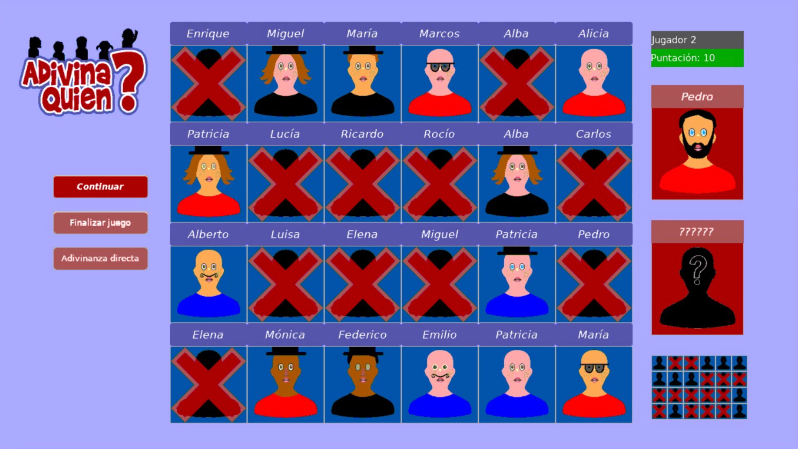

  

<h1 align="center">
    Adivina Quién?
</h1>

  <strong>Spanish version of the board game <a href="https://en.wikipedia.org/wiki/Guess_Who%3F">Guess Who?</a></strong> 
  Written in <a href="https://gambaswiki.org/">GAMBAS</a> 

  
   
   
  

## License

This project is open source software licensed under the MIT License. See [LICENSE](LICENSE) for details.
